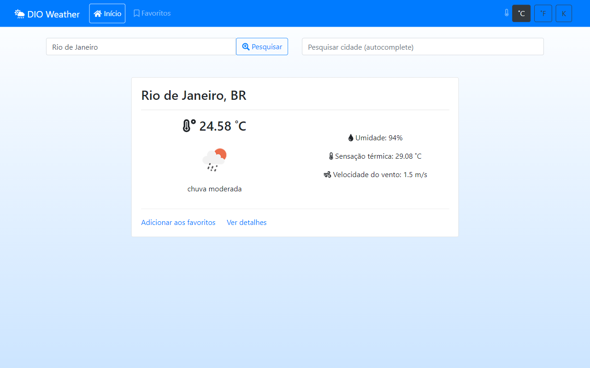
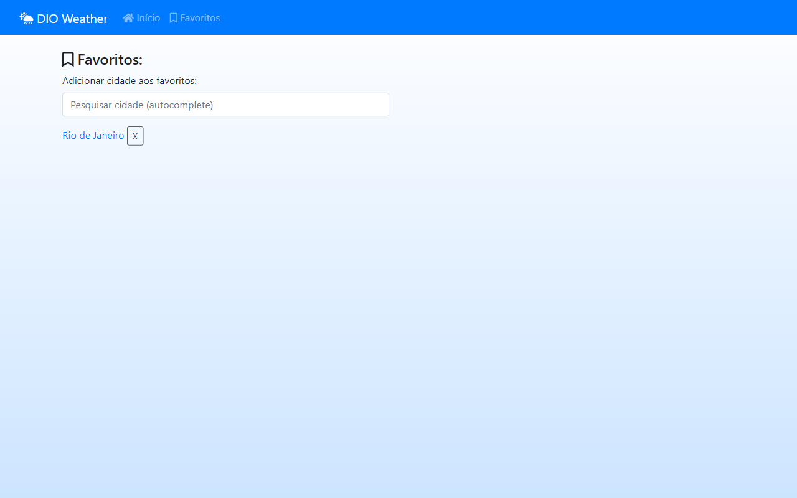
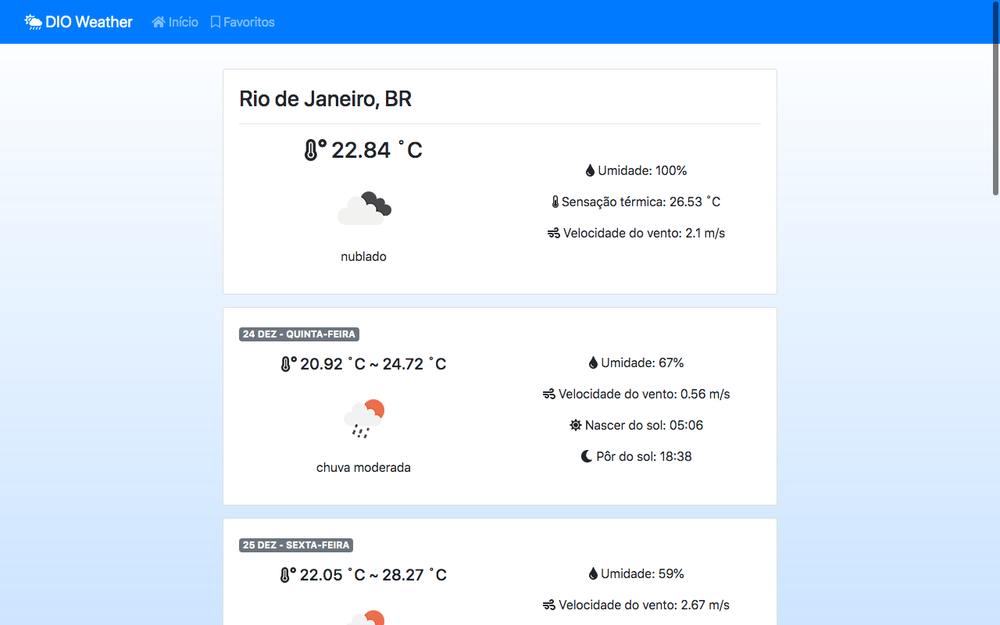
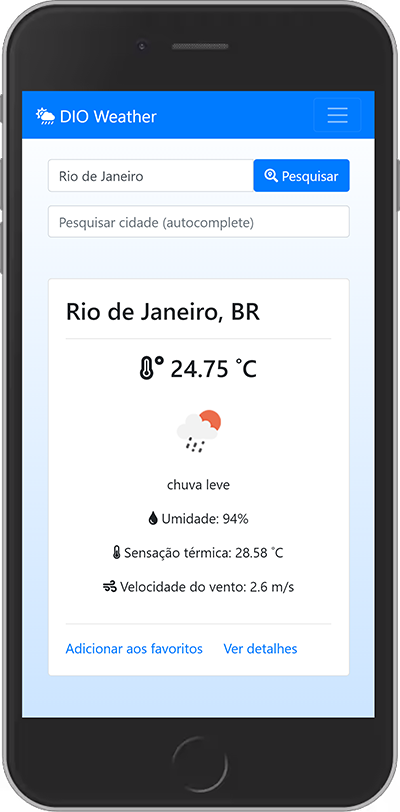
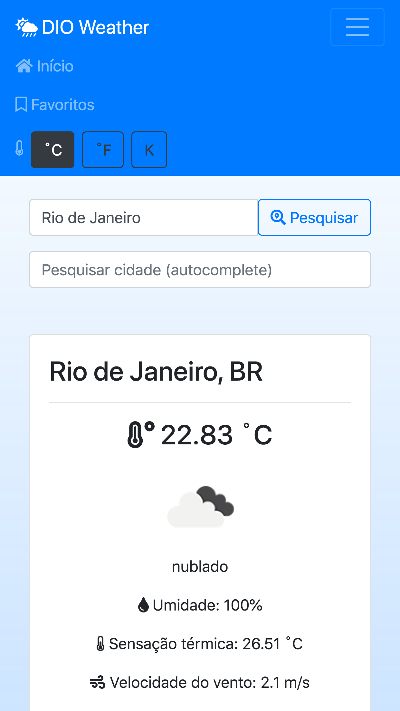
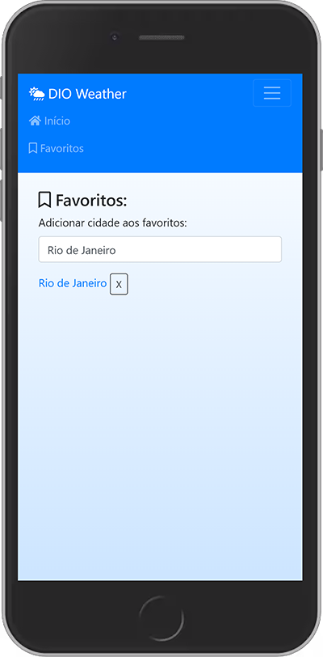
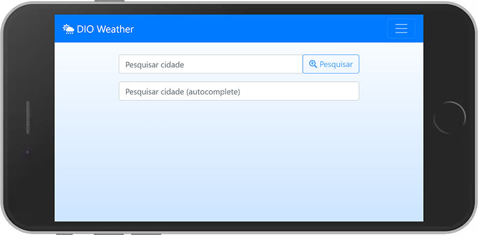
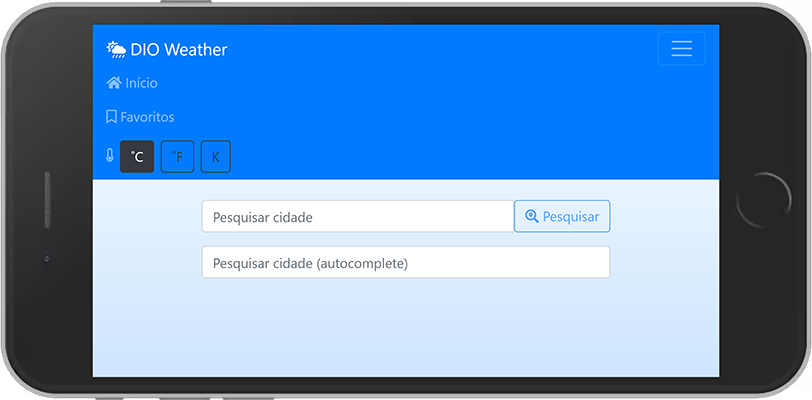

# Digital Innovation One

## Criando projeto para consultar a previsão do tempo via API

O objetivo desse laboratório foi realizar a integração de uma *Single Page Application* (SPA) em Angular com a [Open Weather Map API][openweather-api]. Esse exercício também abordou uma forma mais avançada de gerenciamento de estado com o [NgRx][ngrx-ref], além de práticas e padrões de desenvolvimento, acompanhados de algumas APIs úteis do Angular.

### 🖱 [Clique aqui para ver online.][angular-frontend-app]

---

### ⚔ Desafio

Consumir os recursos da **Open Weather Map API** em um *frontend* Angular.

---

### 📷 Screenshots

---

### 📚 Referências

- [Angular][angular-ref]

[openweather-api]:https://openweathermap.org/
[ngrx-ref]:https://ngrx.io/
[angular-frontend-app]:https://leonardosposina.github.io/dio-weather-app
[angular-ref]:https://angular.io/docs
